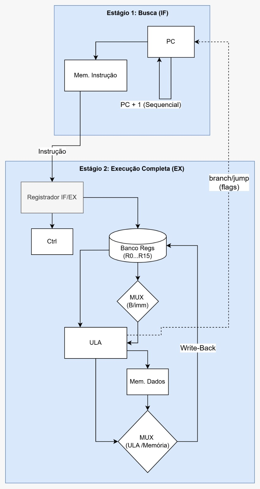

# Processador RISCO — Implementação em SystemC

Implementação didática, em **SystemC**, de um processador RISCO simplificado de 32 bits com **pipeline de dois estágios**. O projeto modela os principais blocos de um processador: contador de programa, memória de instruções, registrador de pipeline IF/EX, unidade de controle, banco de registradores, ULA, memória de dados e lógica de write-back.

> SystemC é uma biblioteca/conjunto de classes e macros em C++ voltada à modelagem e simulação de sistemas de hardware. Neste projeto, ela é usada para descrever módulos síncronos e combinacionais de forma hierárquica e simulável.

---

## Sumário

- [Visão geral](#visão-geral)
- [Arquitetura do processador](#arquitetura-do-processador)
- [Conjunto de instruções — ISA](#conjunto-de-instruções--isa)
- [Formato das instruções](#formato-das-instruções)
- [Convenções de registradores](#convenções-de-registradores)
- [Módulos implementados](#módulos-implementados)
- [Correções e melhorias aplicadas](#correções-e-melhorias-aplicadas)
- [Testbench e validação](#testbench-e-validação)
- [Limitações conhecidas](#limitações-conhecidas)
- [Como compilar e executar](#como-compilar-e-executar)
- [Trabalhos futuros](#trabalhos-futuros)
- [Estrutura dos arquivos](#estrutura-dos-arquivos)

---

## Visão geral

O processador RISCO é uma arquitetura RISC simplificada, com:

- palavra de dados de 32 bits;
- ISA própria com 13 instruções;
- banco com 16 registradores de 32 bits;
- registrador `R0` fixo em zero;
- ULA com 8 operações;
- memória de instruções e memória de dados separadas;
- pipeline de 2 estágios: `IF` e `EX/MEM/WB`;
- geração de arquivo VCD para análise no GTKWave.

O objetivo do projeto é demonstrar, de forma concreta, como instruções são buscadas, decodificadas, executadas e como seus resultados retornam ao estado interno do processador.

---

## Arquitetura do processador

O processador é organizado em dois estágios de pipeline.

### Estágio 1 — Busca de instrução (IF)

No estágio `IF`, o contador de programa (`PC`) fornece o endereço para a memória de instruções. A instrução lida é armazenada no registrador de pipeline `IF/EX`, que a entrega ao estágio seguinte na próxima borda de clock.

O próximo valor do PC pode ser:

- `PC + 1`, para execução sequencial;
- `PC + sign_extend(imm)`, quando um `BEQ` é tomado;
- `sign_extend(imm)`, quando há um `JUMP` absoluto.

### Estágio 2 — Execução completa (EX/MEM/WB)

No estágio `EX/MEM/WB`, a instrução armazenada no registrador `IF/EX` é decodificada pela unidade de controle. Em seguida, o banco de registradores fornece os operandos, a ULA executa a operação solicitada, a memória de dados é acessada em instruções `LOAD` e `STORE`, e o resultado final é selecionado pelo multiplexador de write-back.

O dado escrito no banco de registradores pode vir:

- do resultado da ULA;
- da memória de dados, no caso de `LOAD`.

### Diagrama do datapath



**Figura 1 — Datapath do processador RISCO com pipeline de dois estágios.**

O diagrama mostra a arquitetura geral do processador, com os blocos `PC`, memória de instruções, registrador `IF/EX`, unidade de controle, banco de registradores, ULA, memória de dados e write-back.

A implementação final possui duas adições importantes que não aparecem completamente no diagrama:

1. **Terceiro porto de leitura no banco de registradores (`r3_addr`/`r3_data`)**, usado para ler o registrador `rd` em instruções `STORE` e `BEQ`.
2. **MUX adicional no operando A da ULA**, usado para selecionar `r3_data` durante `BEQ`, permitindo comparar corretamente `rd` com `rs1`.

A separação entre memória de instruções e memória de dados segue uma organização do tipo Harvard. Essa separação favorece a execução em pipeline, pois permite modelar acessos independentes a instruções e dados dentro do mesmo ciclo de clock.

---

## Conjunto de instruções — ISA

A ISA do processador RISCO possui 13 instruções.

| Opcode | Mnemônico | Tipo | Operação |
|---|---|---:|---|
| `0000` | `ADD` | R | `rd = rs1 + rs2` |
| `0001` | `SUB` | R | `rd = rs1 - rs2` |
| `0010` | `AND` | R | `rd = rs1 & rs2` |
| `0011` | `OR` | R | `rd = rs1 \| rs2` |
| `0100` | `XOR` | R | `rd = rs1 ^ rs2` |
| `0101` | `NOT` | R | `rd = ~rs1` |
| `0110` | `SHL` | R | `rd = rs1 << 1` |
| `0111` | `SHR` | R | `rd = rs1 >> 1` |
| `1000` | `ADDI` | I | `rd = rs1 + sign_extend(imm)` |
| `1001` | `LOAD` | I | `rd = mem[rs1 + sign_extend(imm)]` |
| `1010` | `STORE` | I | `mem[rs1 + sign_extend(imm)] = rd` |
| `1011` | `BEQ` | I | `if (rd == rs1) PC = PC + sign_extend(imm)` |
| `1100` | `JUMP` | I | `PC = sign_extend(imm)` |

---

## Formato das instruções

Todas as instruções possuem 32 bits.

### Tipo R

```text
31      28 27    24 23    20 19    16 15        0
┌──────────┬────────┬────────┬────────┬──────────┐
│  opcode  │   rd   │  rs1   │  rs2   │  livre   │
│  4 bits  │ 4 bits │ 4 bits │ 4 bits │  16 bits │
└──────────┴────────┴────────┴────────┴──────────┘
```

Campos:

- `opcode`: operação da instrução;
- `rd`: registrador destino;
- `rs1`: primeiro registrador fonte;
- `rs2`: segundo registrador fonte;
- bits `[15:0]`: não utilizados.

### Tipo I

```text
31      28 27    24 23    20 19                 0
┌──────────┬────────┬────────┬────────────────────┐
│  opcode  │   rd   │  rs1   │     imediato       │
│  4 bits  │ 4 bits │ 4 bits │      20 bits       │
└──────────┴────────┴────────┴────────────────────┘
```

Campos:

- `opcode`: operação da instrução;
- `rd`: registrador destino ou registrador comparado/armazenado, dependendo da instrução;
- `rs1`: registrador base ou operando de comparação;
- `imediato`: campo de 20 bits com sinal.

O imediato é estendido com sinal de 20 para 32 bits antes de ser utilizado pela ULA ou pela lógica de cálculo do PC. Isso permite representar valores negativos, incluindo offsets negativos em `LOAD`, `STORE` e desvios retroativos em `BEQ`.

---

## Convenções de registradores

| Registrador | Convenção |
|---|---|
| `R0` | Zero hardwired, sempre 0 |
| `R1` a `R13` | Uso geral |
| `R14` (`RA`) | Endereço de retorno |
| `R15` (`RB`) | Base pointer / stack pointer |

---

## Módulos implementados

### `ula.h` — Unidade Lógico-Aritmética

A ULA é um módulo combinacional que recebe:

- `A`: operando de 32 bits;
- `B`: operando de 32 bits;
- `ctrl`: código de operação de 4 bits.

Ela produz:

- `resultado`: saída de 32 bits;
- `zero`: indica se o resultado é igual a zero;
- `carry`: indica transporte aritmético;
- `negativo`: indica se o bit 31 do resultado está em 1.

Neste projeto, a flag `zero` é usada pela lógica de controle de fluxo da instrução `BEQ`. As flags `carry` e `negativo` são geradas pela ULA e ficam disponíveis para observação ou extensões futuras da ISA.

Operações suportadas:

| Código | Operação | Descrição |
|---|---|---|
| `0x0` | `ADD` | Soma |
| `0x1` | `SUB` | Subtração |
| `0x2` | `AND` | E lógico bit a bit |
| `0x3` | `OR` | OU lógico bit a bit |
| `0x4` | `XOR` | OU exclusivo bit a bit |
| `0x5` | `NOT` | Negação bit a bit de `A` |
| `0x6` | `SHL` | Deslocamento lógico à esquerda de `A` em 1 bit |
| `0x7` | `SHR` | Deslocamento lógico à direita de `A` em 1 bit |

### `banco_reg.h` — Banco de registradores

O banco de registradores possui:

- 16 registradores de 32 bits (`R0` a `R15`);
- três portas de leitura;
- uma porta de escrita;
- escrita síncrona na borda de subida do clock;
- leitura combinacional.

O registrador `R0` é fixo em zero: tentativas de escrita em `R0` são ignoradas.

As três portas de leitura são:

| Porta | Uso |
|---|---|
| `rs1_addr` / `rs1_data` | Primeiro operando padrão |
| `rs2_addr` / `rs2_data` | Segundo operando padrão |
| `r3_addr` / `r3_data` | Leitura de `rd` para `STORE` e `BEQ` |

O terceiro porto é necessário porque:

- em `STORE`, o dado gravado na memória é o conteúdo de `rd`;
- em `BEQ`, a comparação correta é entre `rd` e `rs1`.

Os registradores internos são modelados como `sc_signal<sc_uint<32>>`. Isso torna o processo de leitura sensível a alterações no conteúdo dos registradores, fazendo com que as saídas sejam atualizadas automaticamente após escritas síncronas no modelo SystemC.

Essa correção resolve o problema de saídas desatualizadas no modelo de simulação, mas não implementa forwarding arquitetural. O processador ainda não possui lógica de bypassing nem unidade automática de detecção de hazards.

### `memoria.h` — Memória genérica

O módulo de memória possui:

- 256 palavras;
- 32 bits por palavra;
- endereçamento por palavra;
- leitura combinacional;
- escrita síncrona.

O mesmo módulo é instanciado duas vezes:

1. memória de instruções;
2. memória de dados.

Quando `leitura = false`, a saída `dado_saida` é explicitamente zerada. Isso evita comportamento de latch, no qual a saída manteria o último valor lido.

O método `carregar()` é usado para inicializar a memória de instruções antes da simulação.

### `controle.h` — Unidade de controle

A unidade de controle decodifica a instrução de 32 bits, extraindo:

- `opcode`: bits `[31:28]`;
- `rd`: bits `[27:24]`;
- `rs1`: bits `[23:20]`;
- `rs2`: bits `[19:16]`;
- `imediato`: bits `[19:0]`.

Ela gera os sinais de controle:

| Sinal | Função |
|---|---|
| `reg_write` | Habilita escrita no banco de registradores |
| `mem_read` | Habilita leitura da memória de dados |
| `mem_write` | Habilita escrita na memória de dados |
| `mem_to_reg` | Seleciona dado da memória para write-back |
| `use_imm` | Seleciona imediato como operando B da ULA |
| `branch` | Indica instrução `BEQ` |
| `jump` | Indica instrução `JUMP` |
| `ula_op` | Código de operação enviado à ULA |

Resumo do comportamento:

- instruções tipo R habilitam `reg_write` e usam o próprio opcode como `ula_op`;
- `ADDI` habilita `reg_write` e `use_imm`;
- `LOAD` habilita `reg_write`, `mem_read`, `mem_to_reg` e `use_imm`;
- `STORE` habilita `mem_write` e `use_imm`;
- `BEQ` habilita `branch` e usa `SUB` na ULA;
- `JUMP` habilita `jump`.

### `datapath.h` — Integração do processador

O `Datapath` é o módulo de topo. Ele integra:

- unidade de controle;
- banco de registradores;
- ULA;
- memória de instruções;
- memória de dados;
- PC;
- registrador `IF/EX`;
- multiplexadores;
- lógica de atualização do PC e flush.

#### Cálculo do próximo PC

A lógica `calc_pc_next()` define:

| Condição | Próximo PC |
|---|---|
| `jump = true` | `PC = sign_extend(imm)` |
| `branch = true` e `zero = true` | `PC = PC + sign_extend(imm)` |
| caso contrário | `PC = PC + 1` |

#### Multiplexadores principais

| MUX | Função |
|---|---|
| `mux_ula_a` | Seleciona `rs1_data` ou `r3_data` para o operando A da ULA |
| `mux_ula_b` | Seleciona `rs2_data`, imediato estendido ou `rs1_data` para o operando B |
| `mux_store_data` | Seleciona o dado gravado na memória em `STORE` |
| `mux_wb` | Seleciona entre resultado da ULA e dado da memória para write-back |

#### Flush de pipeline

Quando ocorre `JUMP` ou `BEQ` tomado, a instrução já buscada no estágio `IF` é descartada. Isso é feito escrevendo `0` no registrador `IF/EX`, inserindo um NOP no pipeline.

---

## Correções e melhorias aplicadas

### 1. Controle da memória de instruções

A memória de instruções deve ser lida continuamente e nunca deve ser escrita durante a execução normal.

Correção aplicada:

- `leitura` conectada a um sinal fixo `true`;
- `escrita` conectada a um sinal fixo `false`.

Isso evita que a memória de instruções dependa indevidamente do `reset` ou seja corrompida por sinais como a flag `zero` da ULA.

### 2. Correção do `STORE`

A instrução `STORE` tem o formato:

```asm
STORE rd, imm(rs1)
```

Seu comportamento é:

```text
mem[rs1 + sign_extend(imm)] = rd
```

A correção adicionou o terceiro porto de leitura do banco de registradores para ler `rd` diretamente. O dado enviado à memória em `STORE` passou a vir de `r3_data`.

### 3. Reatividade do banco de registradores no SystemC

Na versão inicial, os registradores internos eram variáveis simples. Após uma escrita síncrona, o processo de leitura não era automaticamente reexecutado, podendo manter saídas antigas.

Correção aplicada:

- registradores internos modelados como `sc_signal<sc_uint<32>>`;
- processo de leitura sensível aos endereços e ao conteúdo de todos os registradores.

Isso corrige a fidelidade do modelo SystemC. Porém, não equivale a implementar forwarding arquitetural.

### 4. Extensão de sinal do imediato

O imediato de 20 bits é convertido para valor com sinal e estendido para 32 bits antes do uso. Essa correção permite:

- imediatos negativos em `ADDI`;
- offsets negativos em `LOAD` e `STORE`;
- desvios retroativos em `BEQ`;
- endereços absolutos com sinal em `JUMP`.

### 5. Correção do `BEQ`

A instrução `BEQ` compara `rd` com `rs1`.

Para isso:

- operando A da ULA recebe `r3_data`, isto é, o conteúdo de `rd`;
- operando B da ULA recebe `rs1_data`;
- a ULA executa `SUB`;
- se o resultado for zero, o branch é tomado.

### 6. Flush em `BEQ` tomado e `JUMP`

Quando o fluxo de controle muda, a instrução já buscada no estágio `IF` pode ser inválida. A implementação descarta essa instrução escrevendo `0` no registrador `IF/EX`, criando uma bolha no pipeline.

---

## Testbench e validação

O arquivo `testbench.cpp` instancia o `Datapath`, carrega um programa na memória de instruções, aplica reset e executa 25 ciclos de clock. Durante a simulação, são impressos sinais internos como PC, instrução em EX, operandos da ULA, resultado da ULA e dado de write-back.

Ao final, o testbench compara os valores dos registradores e da memória de dados com os resultados esperados.

O testbench cobre todas as instruções da ISA implementada e alguns casos de borda.

### Programa de teste

| End. | Instrução | Hex | O que testa |
|---:|---|---|---|
| 0 | `ADDI R1, R0, 5` | `0x81000005` | `R1 = 5` |
| 1 | `ADDI R2, R0, 3` | `0x82000003` | `R2 = 3` |
| 2 | `ADD R3, R1, R2` | `0x03120000` | `R3 = 8` |
| 3 | `SUB R4, R3, R1` | `0x14310000` | `R4 = 3` |
| 4 | `AND R5, R3, R2` | `0x25320000` | `R5 = 0` |
| 5 | `OR R6, R3, R2` | `0x36320000` | `R6 = 11` |
| 6 | `XOR R7, R3, R2` | `0x47320000` | `R7 = 11` |
| 7 | `NOT R8, R1` | `0x58100000` | `R8 = 0xFFFFFFFA` |
| 8 | `SHL R9, R2` | `0x69200000` | `R9 = 6` |
| 9 | `SHR R10, R3` | `0x7A300000` | `R10 = 4` |
| 10 | `ADDI R11, R0, -1` | `0x8B0FFFFF` | `R11 = 0xFFFFFFFF` |
| 11 | `ADD R0, R1, R2` | `0x00120000` | tentativa de escrita em `R0` |
| 12 | `STORE R3, 10(R0)` | `0xA300000A` | `mem[10] = 8` |
| 13 | `LOAD R12, 10(R0)` | `0x9C00000A` | `R12 = 8` |
| 14 | `ADD R0, R0, R0` | `0x00000000` | NOP demonstrativo pós-LOAD |
| 15 | `BEQ R3, R1, 1` | `0xB3100001` | branch não tomado |
| 16 | `BEQ R1, R1, 1` | `0xB1100001` | branch tomado |
| 17 | `ADDI R13, R0, 99` | `0x8D000063` | deve ser descartada pelo flush |
| 18 | `JUMP 18` | `0xC0000012` | halt por loop infinito |

### Resultados esperados

| Registrador/posição | Valor esperado | Observação |
|---|---:|---|
| `R0` | `0` | hardwired zero |
| `R1` | `5` | resultado de `ADDI` |
| `R2` | `3` | resultado de `ADDI` |
| `R3` | `8` | `R1 + R2` |
| `R4` | `3` | `R3 - R1` |
| `R5` | `0` | `8 & 3` |
| `R6` | `11` | `8 \| 3` |
| `R7` | `11` | `8 ^ 3` |
| `R8` | `0xFFFFFFFA` | `~5` |
| `R9` | `6` | `3 << 1` |
| `R10` | `4` | `8 >> 1` |
| `R11` | `0xFFFFFFFF` | imediato `-1` com extensão de sinal |
| `R12` | `8` | valor carregado de `mem[10]` |
| `R13` | `0` | instrução descartada pelo flush |
| `mem[10]` | `8` | valor armazenado por `STORE` |

### Observação sobre o NOP após `LOAD`

O NOP inserido após o `LOAD` demonstra a convenção de programação necessária para evitar o **load-use hazard**: se uma instrução `LOAD` for seguida imediatamente por uma instrução que usa o registrador carregado, deve-se inserir um NOP entre elas.

Neste programa de teste específico, a instrução posterior relevante é `BEQ R3, R1, 1`, que não consome `R12`. Portanto, o NOP funciona mais como documentação da limitação do pipeline do que como correção de uma dependência real naquele ponto.

Um teste que exercitasse de fato o load-use hazard teria uma instrução lendo `R12` imediatamente após o `LOAD`, sem NOP intermediário.

---

## Limitações conhecidas

### Load-use hazard

O processador não possui forwarding nem unidade automática de stall. Por isso, uma instrução que use imediatamente o resultado de um `LOAD` pode ler o valor antigo do registrador.

Solução adotada:

```asm
LOAD R1, 0(R0)
ADD  R0, R0, R0   ; NOP
ADD  R2, R1, R3   ; uso seguro de R1
```

O programador é responsável por inserir o NOP quando necessário.

### Penalidade de branch tomado

Quando um `BEQ` é tomado, a instrução já buscada no estágio `IF` é descartada por flush. Isso gera uma bolha de 1 ciclo.

Branches não tomados não introduzem essa penalidade, pois a instrução sequencial já buscada é a correta.

### Ausência de forwarding

É importante separar dois aspectos:

1. No nível de simulação SystemC, o uso de `sc_signal` no banco de registradores corrige a atualização das saídas após uma escrita síncrona.
2. No nível arquitetural, o processador não implementa bypassing de dados entre estágios.

Assim, cargas seguidas de uso imediato ainda exigem NOP manual ou, em uma versão futura, uma unidade de stall/forwarding.

### Capacidade limitada das memórias

Cada memória possui 256 palavras de 32 bits. Acessos fora desse intervalo retornam zero silenciosamente, sem gerar exceção ou sinal de erro.

---

## Como compilar e executar

### Dependências

Em Ubuntu/Debian, instale:

```bash
sudo apt update
sudo apt install libsystemc-dev gtkwave
```

### Compilar

```bash
make
```

O Makefile gera o executável:

```text
risco_sim
```

### Executar

```bash
./risco_sim
```

Ou, usando o alvo do Makefile:

```bash
make run
```

### Visualizar formas de onda

A simulação gera o arquivo:

```text
risco_trace.vcd
```

Para abrir no GTKWave:

```bash
gtkwave risco_trace.vcd
```

Ou use:

```bash
make wave
```

O alvo `wave` compila, executa a simulação e abre `risco_trace.vcd` no GTKWave.

### Limpar arquivos gerados

```bash
make clean
```

Esse alvo remove o executável `risco_sim`, arquivos `.vcd` e arquivos objeto.

---

## Trabalhos futuros

Possíveis extensões do projeto:

- implementar forwarding/bypassing;
- adicionar unidade de detecção de hazards e inserção automática de stalls;
- testar branches com offset negativo;
- expandir a ISA com instruções como `BNE`, `BLT`, `BGE`, multiplicação e divisão;
- implementar chamadas de subrotina;
- criar pipeline com mais estágios (`IF`, `ID`, `EX`, `MEM`, `WB`);
- sinalizar exceções para endereços de memória inválidos;
- melhorar a integração com GTKWave por meio de arquivos `.gtkw`.

---

## Estrutura dos arquivos

| Arquivo | Descrição |
|---|---|
| `ula.h` | Unidade Lógico-Aritmética |
| `banco_reg.h` | Banco de registradores com 3 portas de leitura e 1 de escrita |
| `memoria.h` | Memória genérica de 256 palavras de 32 bits |
| `controle.h` | Unidade de controle e decodificação de instruções |
| `datapath.h` | Integração dos módulos, pipeline, PC, MUXes e flush |
| `testbench.cpp` | Programa de teste e verificação automática |
| `Makefile` | Script de compilação, execução, abertura do GTKWave e limpeza |
| `Datapath.jpeg` | Diagrama da arquitetura geral do datapath |
| `risco_trace.vcd` | Arquivo de formas de onda gerado pela simulação |

---

## Observação final

Este projeto não implementa um processador comercial ou completo. Ele é uma implementação didática de uma arquitetura RISC simplificada, útil para estudar datapath, unidade de controle, pipeline, hazards, memória, registradores e simulação de hardware com SystemC.
